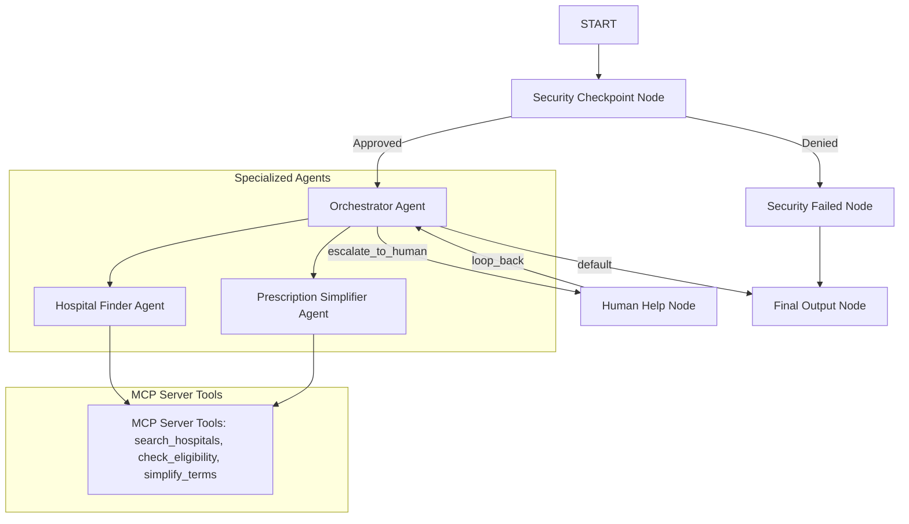

# AyushMitra 🩺
AyushMitra is an intelligent, secure multi-agent assistant designed to help Indian citizens navigate the public healthcare system (Ayushman Bharat empanelled hospitals, eligibility checks, and prescription translations).

## Prerequisites
- Python 3.11 or higher
- [uv](https://astral.sh/uv/) (fast Python package manager)
- Gemini API Key (Get one from [Google AI Studio](https://aistudio.google.com/apikey))

## Quick Start
```bash
# Clone the repository
git clone <repo-url>
cd ayush-mitra

# Set up environment variables
cp .env.example .env   # edit .env and paste your GOOGLE_API_KEY

# Install dependencies and build project
make install

# Start the interactive local Playground UI
make playground
```
Once started, the Playground UI will be accessible at **http://localhost:18081**.

## Architecture Diagram


## How to Run
- `make playground` : Launches the developer testing UI at http://localhost:18081
- `make run` : Runs the agent as a local FastAPI web server
- `make test` : Runs the unit test suite locally

## Sample Test Cases

### Test Case 1: Search for Empanelled Hospital (Approved)
* **Input**: `"Find an Ayushman hospital for heart treatment in Delhi."`
* **Expected**: The query passes the Security Checkpoint (contains domain keywords), delegates to the `hospital_finder` agent, uses the `search_hospitals` MCP tool, and returns a matching list of hospitals.
* **Check**: Check that the workflow completes successfully and lists hospitals.

### Test Case 2: PII Redaction Check
* **Input**: `"My phone is 9988776655. Can I find a wellness clinic near Mumbai?"`
* **Expected**: The query passes, but the phone number is redacted to `<REDACTED_PHONE>` before being forwarded to the agents.
* **Check**: Inspect the logs or session trace to see that the processed query contains `<REDACTED_PHONE>`.

### Test Case 3: Off-Topic Block
* **Input**: `"Write a Python script to sort a list using quicksort."`
* **Expected**: The Security Checkpoint flags the query as off-topic (unrelated to healthcare/hospitals), sets the route to `denied`, and returns: `"Request rejected: Query must be related to healthcare, hospitals, or prescriptions."`
* **Check**: The UI should show the denied response, and a warning log is recorded in `logs/security.log`.

## Troubleshooting
1. **Error: `KeyError: 'audit_log'`**
   - *Fix*: This occurs if you are running an outdated server process. Fully kill the uvicorn/playground processes and start a fresh server using `make playground`.
2. **Error: `404 model not found`**
   - *Fix*: Ensure your `.env` contains `GEMINI_MODEL=gemini-2.5-flash` or `gemini-2.5-flash-lite`. Retired models like `gemini-1.5-*` will return 404.
3. **Error: `429 API rate limit exceeded`**
   - *Fix*: You have reached your Gemini API free-tier quota limits. Wait a few minutes or switch to a new API key from a different Google account.


