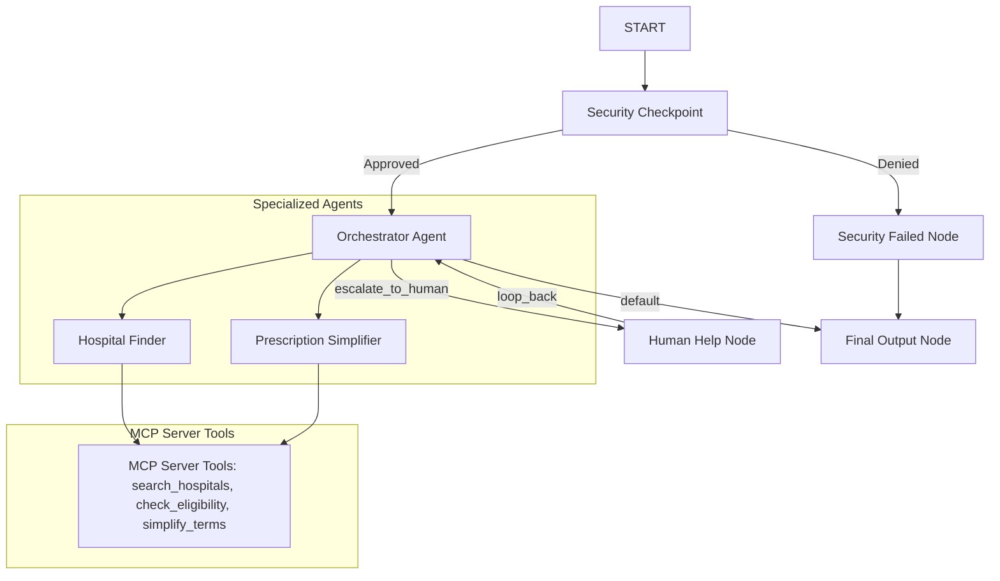

# Submission Write-Up - AyushMitra 🩺

## Problem Statement
Accessing public healthcare in India remains a significant hurdle. Navigating government schemes like Ayushman Bharat (PM-JAY) to identify empanelled hospitals, understand eligibility requirements, and decode medical prescriptions involves complex paperwork and high cognitive load, especially for vernacular and low-literacy users. AyushMitra acts as an intelligent digital companion, lowering these accessibility barriers.

## Solution Architecture
The system utilizes a structured event-driven workflow compiled via the ADK 2.0 Workflow API. It intercepts user queries at a security checkpoint, enforces content guards, identifies intent, and delegates tasks to specialized sub-agents backed by an MCP (Model Context Protocol) toolserver.

## Concepts Used

### 1. ADK Multi-Agent Workflow
- Implemented in [agent.py](app/agent.py) using the ADK 2.0 workflow syntax.
- Defines a state schema `AyushMitraState` representing the context variables (query, routes, audit log, results).
- The `orchestrator` agent manages execution paths and delegates to sub-agents (`hospital_finder`, `prescription_simplifier`) using `AgentTool` definitions.

### 2. MCP Server Integration
- Implemented in [mcp_server.py](app/mcp_server.py).
- Exposes tools like:
  - `search_hospitals`: Finds empanelled clinics matching regions and medical specialties.
  - `check_eligibility`: Validates PM-JAY card credentials or criteria.
  - `simplify_terms`: Decodes abbreviations and medical shorthand (e.g. "T.I.D.", "Post-prandial").
- Wired directly to the sub-agents using `McpToolset`.

### 3. Security Checkpoint
- Implemented in [agent.py](app/agent.py) (`_security_checkpoint` helper).
- Employs regex-based PII scrubbing (phone, email, Aadhaar, PAN) via `app.security`.
- Restricts processing to healthcare domains through keyword/phrase verification.
- Intercepts prompt injection attempts (e.g. "ignore rules") and routes traffic to a denied endpoint.
- Appends serialized structured JSON logs of every audit decision to the session state and `security.log`.

### 4. Human-In-The-Loop (HITL)
- Uses `RequestInput` inside `human_help_node` to pause the workflow execution.
- Prompts a healthcare representative to handle complex or unhandled requests, resuming operation when feedback is submitted.

## Security Design
- **PII Scrubbing**: Prevents patient privacy leakage by replacing sensitive details with tokens (e.g. `<REDACTED_AADHAR>`).
- **Prompt Injection Defense**: Validates input safety before running LLM operations.
- **Audit Trails**: Generates structured, time-stamped JSON logs indicating decision metrics, ensuring accountability.

## Impact / Value Statement
AyushMitra streamlines public healthcare search by offering conversational access to PM-JAY services. By translating jargon and simplifying clinical instructions, it promotes health literacy and assists regional users in securing healthcare access efficiently.
